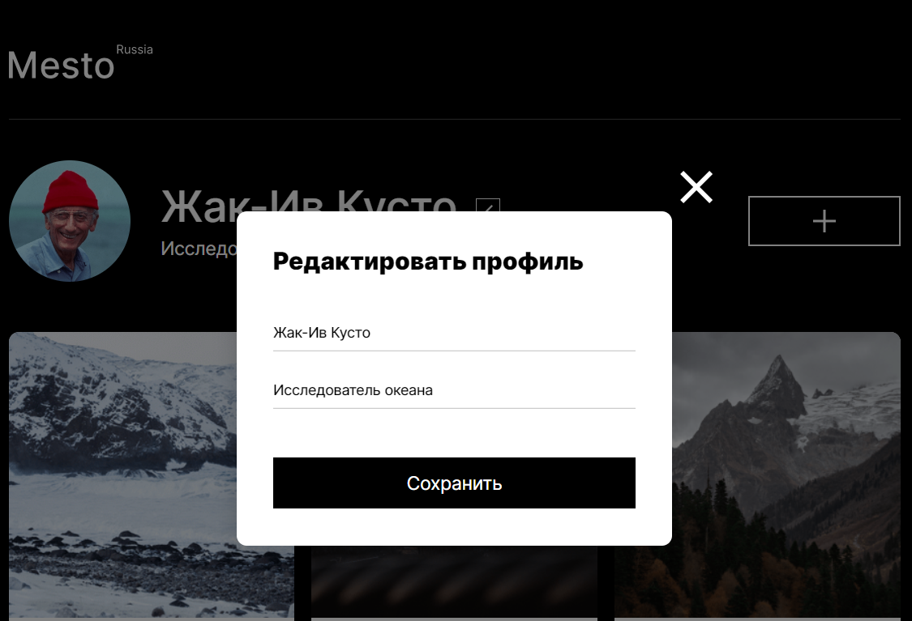
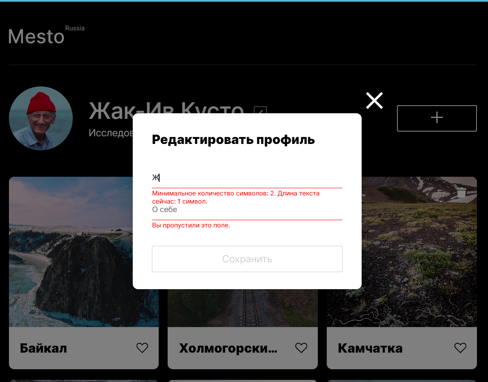
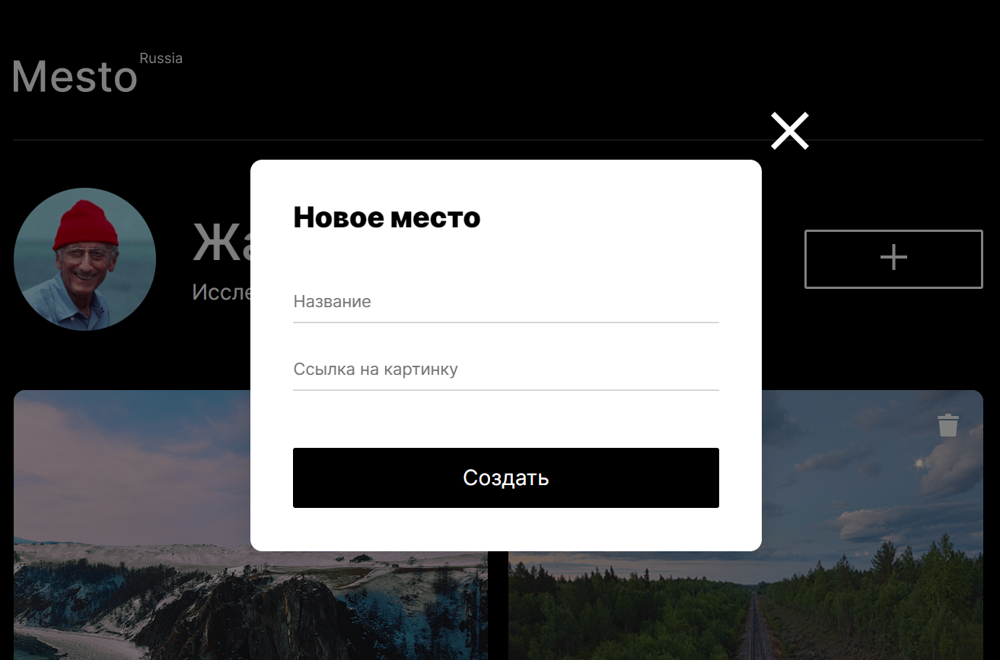
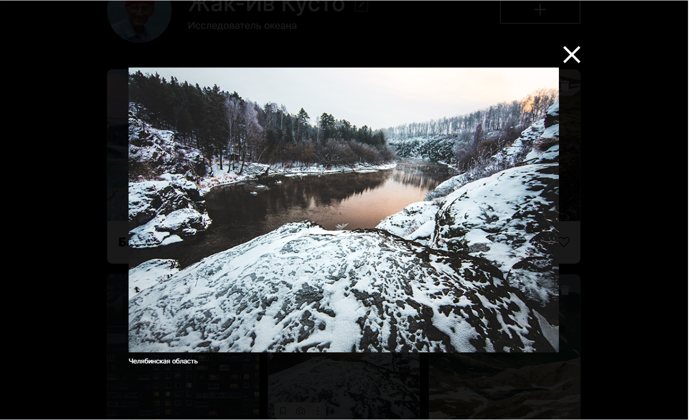
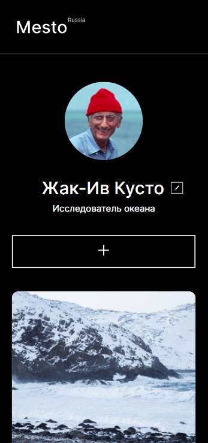
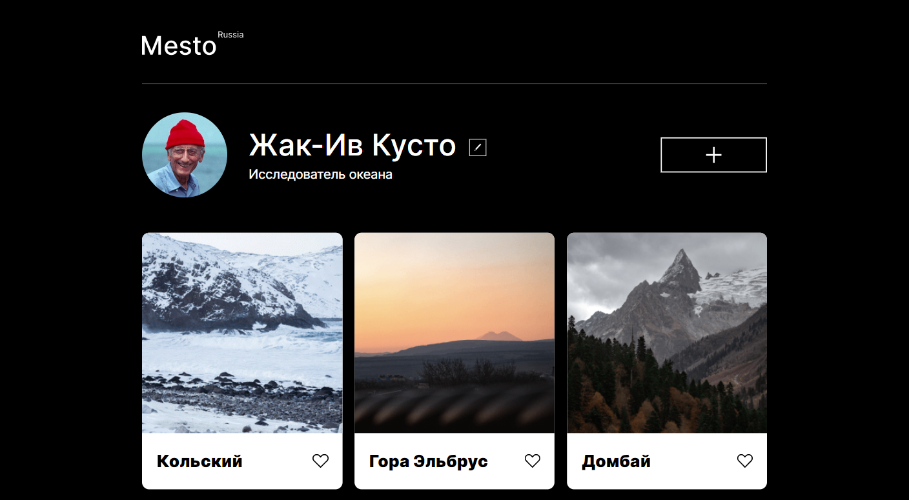

# Проект: Место

### Обзор
* Описание
* Структура с примерами оформления

**Описание**

Ссылка: **(https://Vitaliy23Nikolaenko.github.io/mesto/index.html)**
;

Одностраничный сайт от [**Яндекс.Практикум**](https://practicum.yandex.ru/) с графическим офрмлением, представляющий собой интерактивный сервис со следующими возможностями:
  * редактирование профиля через модальное окно;
  * добавление/удаление публикаций;
  * проставление реакций;
  * откррытие фотографии в увеличенном размере.

**Структура с примерами оформления**

Сайт включает в себя следующие **секции**:

**1.** Шапка сайта (**header**) с логотипом.

**2.** Секция **profile** с описанием профиля и возможностью его редактирования через всплывающее модальное окно c валидацией, а также кнопка для добавления контента страницы через всплывающее модальное окно.

**3.** Секция **places** с возможностью добавления публикаций, в которых содержатся фотография локации, название, кнопка реакции(лайк) и кнопка удаления публикации. Реализована возможность просмотра увеличенного изображения из публикации в всплывающем модальном окне.

Применена адаптивная верстка для дисплеев с разрешением от 320px до 1280px.

**320px**

;

**1280px**

;

Применен объектно-ориентированный подход разработки:
* используются классы - каждый класс описан в отдельном файле и импортирован в главный index.js;
* использована слабая связь между классами.

Проект выполнен с помощью **HTML**,**СSS** и **JavaScript(ES6)**.

